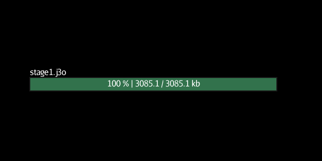

# Quickloader

simple loader for jmonkey

## Example

```
package com.vushu.quickloader;
import java.util.logging.Logger;

import com.jme3.app.Application;
import com.jme3.app.state.BaseAppState;
import com.jme3.asset.AssetManager;
import com.jme3.material.Material;
import com.jme3.scene.Node;
import com.jme3.scene.Spatial;

public class StateTest extends BaseAppState implements QuickLoadListener {

    public static Logger logger = Logger.getGlobal();
    public AssetManager assetmanager;
    @Override
    protected void initialize(Application app) {
        this.assetmanager = app.getAssetManager();
        QuickLoader.setListener(this);
        //load scene
        Node level = (Node) QuickLoader.loadModel("/scenes/stage1.j3o", app.getAssetManager());
        // load tank model
        Spatial tank = QuickLoader.loadModel("/models/tank.j3o", assetmanager);
        Material pbrMat =  QuickLoader.loadMaterial("/models/tank.j3m", assetmanager);
        tank.setMaterial(pbrMat);
    }

    @Override
    protected void cleanup(Application app) {
        // TODO Auto-generated method stub

    }

    @Override
    protected void onEnable() {
        // TODO Auto-generated method stub

    }

    @Override
    protected void onDisable() {
        // TODO Auto-generated method stub

    }

    @Override
    public void onLoading(String file, int bytesRead, int size) {
        float percentLoaded = (float) bytesRead / (float) size * 100;
        if (percentLoaded % 1 == 0){
            String loadText = String.format("%.0f %% | %.1f / %.1f kb",percentLoaded, (float) bytesRead/1024, (float) size/1024);
            logger.info(file + ": " + loadText);
        }

    }


}

```

## Using lemur to create custom as progress bar



